# 开发环境搭建

## Ubuntu 开发环境搭建

### 软件安装

1. 在 Ubuntu 终端中使用下面命令，安装如下软件包，准备好开发所需的主机环境。

   ```shell
   sudo apt update
   sudo apt install repo gawk wget git diffstat unzip texinfo gcc build-essential chrpath socat cpio python3 python3-pip python3-pexpect xz-utils debianutils iputils-ping python3-git python3-jinja2 libegl1-mesa libsdl1.2-dev pylint xterm python3-subunit mesa-common-dev zstd liblz4-tool locales tar python-is-python3 file libxml-opml-simplegen-perl vim whiptail bc
   sudo apt install lib32stdc++6 libncurses5 checkinstall libreadline-dev libncursesw5-dev libssl-dev libsqlite3-dev tk-dev libgdbm-dev libc6-dev libbz2-dev libffi-dev curl git-lfs libncurses5-dev libncursesw5-dev
   ```

2. 在 Ubuntu 终端中使用下面命令，安装 Python 3.10.2，在 [Linux kernel 的打包](3.linux-kernel.md#Linuxkernelpack)过程中用到了`python3.10`命令，如果已经有 Python 3.10.2 或更高版本，请跳过这个步骤。

   ```shell
   python --version
   # Download it in a directory of your choice
   wget https://www.python.org/ftp/python/3.10.2/Python-3.10.2.tgz
   tar -xvf Python-3.10.2.tgz
   cd Python-3.10.2
   ./configure --enable-optimizations
   make
   sudo make install
   ```

3. 在 Ubuntu 终端中使用下面命令，安装 pefile。

   ```shell
   sudo pip3.10 install pefile
   ```

### 安装交叉编译工具
<a id="installcrosstool"></a>

1. 在 Ubuntu 主机上，访问 [RUBIK Pi 3 官方网站](https://www.thundercomm.com/rubik-pi-3/cn/docs/image)，下载 RUBIK Pi 3 的交叉编译工具链，下载完成后使用下面命令解压。

   ```shell
   unzip toolchains_V1.1.0.zip
   ```

   :::note
   
   交叉编译工具是使用 Yocto 工程编译的 eSDK，eSDK 是从 Qualcomm Linux 镜像生成的软件包。它安装在 Ubuntu 主机上并提供基于 Yocto 的环境，可用于应用程序的开发。
   
   关于 eSDK 的编译可参考 [Yocto 工程编译指南](11.yocto-project-user-guide.md)章节。
   :::

2. 在 Ubuntu 终端中使用下面命令，安装交叉编译工具链。

   ```shell
   cd toolchains
   chmod 755 qcom-wayland-x86_64-qcom-multimedia-image-armv8-2a-qcm6490-idp-toolchain-ext-1.3-ver.1.1.sh
   sh qcom-wayland-x86_64-qcom-multimedia-image-armv8-2a-qcm6490-idp-toolchain-ext-1.3-ver.1.1.sh
   ```

3. 按照提示安装交叉编译环境，如下输入安装目录的绝对路径回车后，输入 "Y"**&#x20;**&#x8FDB;行安装。

   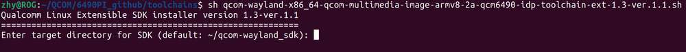

4. 安装完成后，到安装目录执行如下命令，设置交叉编译环境。

   ```shell
   source environment-setup-armv8-2a-qcom-linux
   ```

   :::info
   >
   > 交叉编译环境只对当前终端有效。
   :::

   若出现如下错误，可按提示输入`unset LD_LIBRARY_PATH` 命令后，再次执行上面命令。

   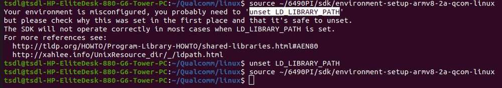

5. 在 Ubuntu 终端中使用下面命令，查看 gcc 工具链版本，若输出如下内容说明交叉编译环境设置成功。

   ```shell
   aarch64-qcom-linux-gcc -v
   ```

   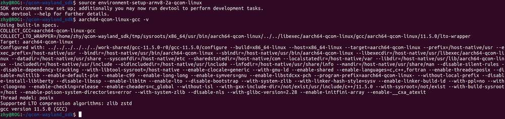

### 交叉编译工具使用方法
<a id="usecrosstool"></a>

在上一小节中，通过  `source environment-setup-armv8-2a-qcom-linux` 命令设置好交叉编译环境后，可以通过下面的方法，交叉编译 RUBIK Pi 3 的可执行程序。

#### 使用 Makefile 构建项目

交叉编译需要设置头文件路径（sysroot），可使用`--sysroot=dir `参数指定。

```shell
aarch64-qcom-linux-gcc --sysroot=/home/zhy/rubikpi/sdk/sysroots/armv8-2a-qcom-linux
```

:::note

 在上面命令中，交叉编译工具链安装在了 PC &#x673A;*&#x20;/home/zhy/rubikpi/sdk* 目录下，请按实际安装目录进行修改。
:::

#### 使用 CMake 构建项目

如下为使用 aarch64.cmake 设置编译工具链的简单示例:

```cmake
set(CMAKE_SYSTEM_NAME Linux)
set(CMAKE_SYSTEM_PROCESSOR arm64) #设置目标处理器架构

#设置sysroot
set(TOOLCHAIN_DIR /home/zhy/rubikpi/sdk/sysroots/armv8-2a-qcom-linux)
set(CMAKE_SYSROOT ${TOOLCHAIN_DIR}/sysroots/armv8-2a-qcom-linux)

#设置交叉编译器
SET(CMAKE_C_COMPILER ${TOOLCHAIN_DIR}/sysroots/x86_64-qcomsdk-linux/usr/bin/aarch64-qcom-linux/aarch64-qcom-linux-gcc)
SET(CMAKE_CXX_COMPILER ${TOOLCHAIN_DIR}/sysroots/x86_64-qcomsdk-linux/usr/bin/aarch64-qcom-linux/aarch64-qcom-linux-g++)

set(CMAKE_FIND_ROOT_PATH_MODE_PROGRAM NEVER)
set(CMAKE_FIND_ROOT_PATH_MODE_LIBRARY ONLY)
set(CMAKE_FIND_ROOT_PATH_MODE_INCLUDE ONLY)
```

在使用 Cmake 构建项目时，需要按项目情况创建 *CMakeLists.txt*，并执行如下命令，生成 Makefile 文件。

```shell
$ cmake -DCMAKE_TOOLCHAIN_FILE=aarch64.cmake 
```

## Windows 11 开发环境搭建
<a id="setwin"></a>

使用 WSL 在 Windows 11 上搭建 Ubuntu VM。

Windows Subsystem for Linux (WSL) 是一项 Windows 功能，允许您在不使用虚拟化软件的情况下在 Windows 上运行 Linux 分发版。在 Windows 11 上设置 WSL 涉及以下任务：


:::note
只能使用 WSL 编译 Qualcomm Linux 软件。要在 RUBIK Pi 3 上刷写软件，请参阅 [Windows 烧录方法](./1.quick-start/1.update-software.md#使用-qdl-工具进行烧录)。
:::

### 主机要求

在使用 WSL 设置 Ubuntu VM 之前，请确保 Windows 11 主机满足以下系统要求：
|                      | 要求               |
|----------------------|---------------------------|
| 处理器架构            | x86 or Arm®              |
| CPU 核数量            | 8 or more                 |
| RAM                  | 8 GB or larger            |
| 存储                  | 300 GB available space    |
| 操作系统             | Windows 11                |

### 设置 WSL 的先决条件

要设置 WSL，您必须打开特定的 Windows 功能并设置默认的 WSL 版本。

* Windows Subsystem for Linux

* Virtual Machine Platform

请使用管理员权限在 Windows PowerShell 中运行以下命令，以便打开这些功能：

* Windows Subsystem for Linux

```sql
Enable-WindowsOptionalFeature -Online -FeatureName Microsoft-Windows-Subsystem-Linux
```

* Virtual Machine Platform

```sql
Enable-WindowsOptionalFeature -Online -FeatureName VirtualMachinePlatform
```

 :::note

 运行这些命令后，重启 Windows 11 主机。
 :::

### 设置默认 WSL 版本

要将 Windows Subsystem for Linux 2 设置为默认的 Linux 分发版，请使用管理员权限在 Windows PowerShell 中运行以下命令：

```sql
wsl --set-default-version 2
```

输出如下：

```sql
For information on key differences with WSL 2 please visit https://aka.ms/wsl2. The operation completed successfully.
```

### 安装 Ubuntu-22.04 Linux 分发版

Qualcomm Linux 使用 Ubuntu-22.04 Linux 分发版。在安装 Ubuntu-22.04 之前，请验证它是否可作为安装在 Windows 11 主机上的有效分发版之一。

1. 要列出可供安装的分发版，请在 Windows PowerShell 中运行以下命令：

```sql
wsl --list --online
```

2. 验证 Ubuntu-22.04 是否被列为分发版之一。

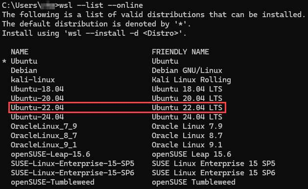

:::note

如果在列出的分发版中没有看到 Ubuntu-22.04，请联系 Microsoft 支持。
:::

3. 要更新 WSL，请运行以下命令：

```sql
wsl --update
```

4. 要安装 Ubuntu 22.04 LTS，请运行以下命令：

```sql
wsl --install -d Ubuntu-22.04
```

5. 安装完成后，设置您安装的 Ubuntu-22.04 Linux 分发版的用户名和密码。

### 为 WSL 创建 .wslconfig 文件

使用 *.wslconfig* 文件配置设置，例如在 WSL 上运行的 Linux 分发版的内存、处理器和交换存储空间。默认情况下 *.wslconfig* 文件不存在。因此，您必须在 *%UserProfile%* 目录中创建一个。

请执行以下操作，以便创建 *.wslconfig* 文件：

1. 在Windows PowerShell 中，运行 `cd ~` 命令进入 *%UserProfile%* 目录。例如，目录路径可以是 *C:\Users\ \<UserName>*。

2. 创建名为 *.wslconfig* 且包含以下内容的文件：

```shell
# Settings apply across all Linux distributions running on WSL 2
[wsl2]
# Limits VM memory to use no more than 4 GB, this can be set as whole numbers using GB or MB
memory=64GB
# Sets the VM to use two virtual processors
processors=16
# Sets amount of swap storage space to 8GB, default is 25% of available RAM
swap=64GB
# Sets swapfile path location, default is %USERPROFILE%\AppData\Local\Temp\swap.vhdx
swapfile=C:\\temp\\wsl-swap.vhdx
# Enable experimental features
[experimental]
# Automatically releases cached memory after detecting idle CPU usage. Set to gradual for slow release, and dropcache for instant release of cached memory.
autoMemoryReclaim=dropcache
```

:::note

设置内存、处理器和交换大小的值以与 Windows 主机的规格相匹配。
:::

3. 要关闭 WSL，请在 Windows PowerShell 中运行以下命令：

```shell
wsl --shutdown
```

4. 要重启 WSL，请在 Windows PowerShell 中运行以下命令：

```shell
wsl
```

### 设置 WSL 环境

要配置 WSL 的 DNS 设置，请使用 resolv.conf 文件。

要为您安装的 Ubuntu-22.04 Linux 分发版配置本地设置，请使用 wsl.conf 文件。每次运行 WSL 时都会自动应用 wsl.conf 文件中的设置。

### 配置 WSL 的 DNS 设置（resolv.conf 文件）

在 Linux 终端窗口中，使用 `sudo` 命令在 */etc/resolv.conf* 文件中添加以下内容：

```shell
sudo rm /etc/resolv.conf
sudo bash -c 'echo "nameserver 8.8.8.8" > /etc/resolv.conf'
```

当您关闭 Linux 终端窗口时，nameserver 会自动恢复为其默认 nameserver。要永久保存对 resolv.conf 文件所做的更改，请运行以下命令：

```powershell
sudo chattr -f +i /etc/resolv.conf
```

要更改写入权限并修改 resolv.conf 文件，请运行以下命令：

```powershell
sudo chattr -f -i /etc/resolv.conf
```

### 配置 Ubuntu-22.04 的本地设置（wsl.conf 文件）

在 Linux 终端窗口中，使用 `sudo` 命令在 */etc/wsl.conf* 文件中添加以下内容：

```shell
[network]
generateResolvConf = false
[automount]
options = "metadata"
[boot]
command = service docker start
```

在 Windows PowerShell 中，运行以下命令以重启 WSL:

```shell
wsl --shutdown
```

### 启动对 Git 的长路径支持

要启用对 Git 的长路径支持，请在 Linux 终端窗口中运行以下命令：

```shell
git config --global core.longpaths true
```

### 可选：更改 Ubuntu 安装驱动器

默认情况下，Ubuntu 安装在 C 盘。如果 Windows 主机上的 C 盘没有足够的空间进行编译，则可以将 Ubuntu 安装到另一个驱动器上。

要将 Ubuntu 安装更改到另一个驱动器上，请执行以下操作：

1. 打开 **Add or Remove Programs**，然后在列表中找到 Ubuntu 安装。

2. 在 **Control Panel** 中，选择 **Programs** > **Programs and Features**

3. 右键点击要更改驱动器的 Ubuntu 安装，然后选择 **Uninstall** 或 **Uninstall/Change**。

此时将显示以下对话框：

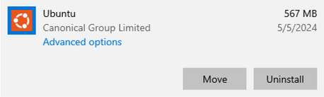

4. 点击 **Move**。

5. 选择要安装 Ubuntu 的驱动器，然后点击 **Move**。

:::note

要访问 WSL 工作区，请使用 Windows 文件资源管理转到以下路径：

 `\\wsl$`
:::

## Mac 开发环境搭建（Arm64）
<a id="setmac"></a>

使用 UTM 在 Arm64 Mac 上搭建 Ubuntu Server VM。

UTM 是适用于 macOS(®) 的开源 VM 主机，用于在 Mac 上运行其他操作系统，包括 Ubuntu。在 Arm64 Mac 上使用 UTM 搭建 Ubuntu Server VM 涉及以下任务：


### 主机要求

在使用 UTM 设置 Ubuntu Server VM 之前，请确保您的 Arm64 Mac 主机满足以下系统要求：
|       |要求                              |
|-----------------------|------------------------------------------|
| 处理器架构 | Arm64 <p>要验证 Mac 的架构是否为 Arm64，请在终端窗口中运行 `uname -a` 命令。</p> |
| CPU 核数量        | 8 个或更多                                |
| RAM                   | 8 GB 或更大                          |
| 存储            | UTM VM 需要 300 GB 可用空间         |
| 操作系统     | macOS 14                                 |

如果您的 Arm64 Mac 主机满足系统要求，请下载以下软件：
| 软件                     | 说明 |
|------------------------------|-------------|
| UTM 虚拟化软件  | 从 [UTM 网站](https://mac.getutm.app/)下载 UTM 虚拟化软件。 |
| Ubuntu 服务器 ISO            | 支持所有 Ubuntu 22.04 64 位 ARM (ARMv8/AArch64) 服务器 LTS 版本。建议用户从 [Ubuntu 网站](https://ubuntu.com/download/server/arm)下载最新的 Ubuntu Server 22.04 ISO（例如 ubuntu-22.04.5-live-server-arm64.iso）版本。 |

### 在 Arm64 Mac 上安装 UTM

1. 双击之前下载的 **UTM.dmg** 文件，然后将 **UTM** 图标拖到 **Applications** 图标。


2. 安装 UTM 时，如果出现以下对话框，点击 **Open**：


3. 打开 Launchpad，搜索 **UTM**，然后点击 **UTM**。

出现 UTM 主窗口。

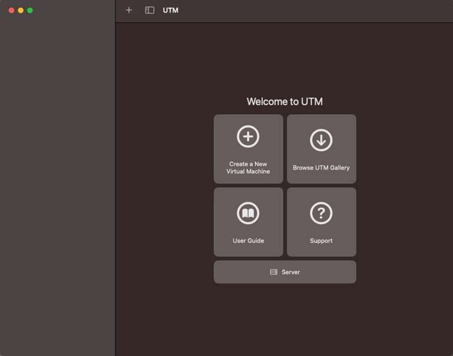

### 在 UTM 中创建 VM

1. 在 UTM 主窗口中，点击 **Create a New Virtual Machine**。

2. 在 **Start** 界面上，点击 **Virtualize**。

3. 在 **Operating System** 界面上，选择 **Linux OS**。

4. 在 **Linux** 界面上，浏览并选择您下载的 Ubuntu ISO 映像，然后点击 **Continue**。

5. 在 **Hardware** 界面上，指定要分配给 Ubuntu VM 的内存和 CPU 核，然后点击 **Continue**。推荐值如下所示：

   * 内存：大约 70% 的可用内存

   * CPU 核：至少 50% 的可用核

   如果将 **CPU Cores** 字段留空或设置为 0，UTM 会将所有主机核心分配给 VM。将所有 CPU 核分配给 VM 可能会使主机运行缓慢或无响应。

:::note

要了解 Mac 主机的内存大小和 CPU 核数量，参见 [macOS User Guide](https://support.apple.com/en-in/guide/mac-help/syspr35536/mac) 中的说明。
:::

6. 在 **Storage** 界面上，指定 VM 的驱动器大小，然后单击 **Continue**。

:::note

建议为虚拟机分配至少 300 GB 的存储空间。
:::

7. 如果要在主机和虚拟机之间共享目录，请在 **Shared Directory** 界面上执行以下操作：

    1. 浏览并选择目录。

    2. 点击 **Continue**。

8. 在 **Summary** 界面上，执行以下操作：

    1. 查看正在创建的虚拟机的配置摘要。

    2. 为虚拟机提供名称。

    3. 点击 **Save**。新创建的虚拟机列在 UTM 主窗口中。

    

### 在 UTM 中安装 Ubuntu Server

1. 运行 UTM。

2. 在 UTM 主窗口中，点击 **Play** 图标，通过虚拟化运行 Ubuntu ISO 镜像。

3. 使用箭头键选择 **Try or Install Ubuntu Server**，然后按 **Enter**。

    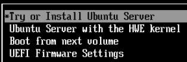

4. 选择一种语言，然后按 **Enter**。

5. 可选：可能会看到更新安装程序的界面。选择以下选项之一，然后按 **Enter**：

    * **Update to the new installer**

    * **Continue without updating**

6. 选择键盘布局，选择 **Done**，然后按 **Enter**。

7. 选择 **Ubuntu Server** 安装库，选择 **Done**，然后按 **Enter**。

8. 选择适当的网络接口，选择 **Done**，然后按 **Enter**。

9. 选择适当的代理配置，选择 **Done**，然后按 **Enter**。

10. 如果需要，可配置镜像地址，并等待镜像位置通过所有测试后，选择 **Done**，然后按 **Enter**。

    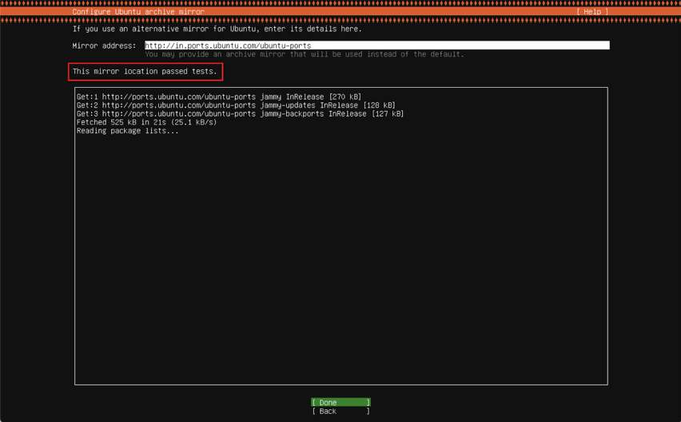

11. 选择 **Use an entire disk** > **Set up this disk as an LVM group**，选择 **Done**，然后按 **Enter**。

    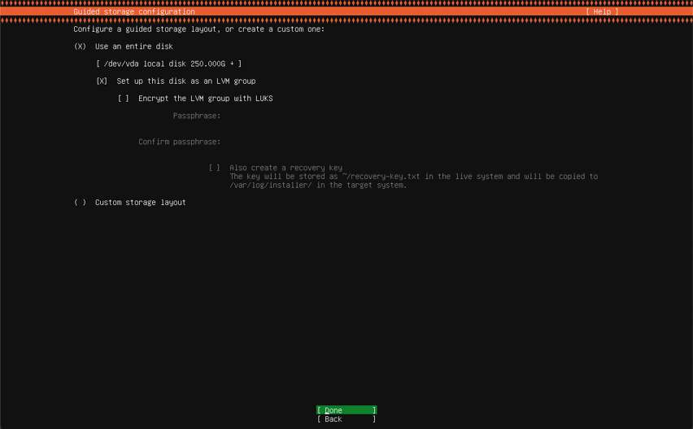

12. 按如下方式配置存储空间：

    1. 在 **USED DEVICES** 部分，选择 **ubuntu-lv**，然后按 **Enter** 查看其他选项。

    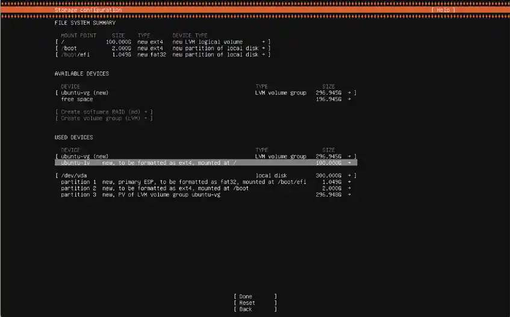

    2. 在对话框中，选择 **Edit**，然后按 **Enter**。

    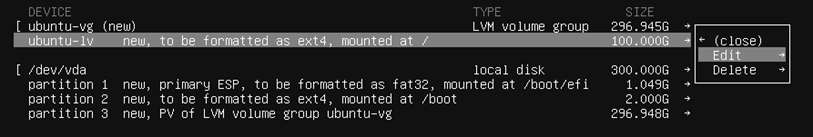

    3. 在 **Size** 字段中，输入 *296.000G*，选择 **Save**，然后按 **Enter**。更新后的大小现在应该体现在 ubuntu-lv 条目中。

    4. 选择 **Done**，然后按 **Enter**。

13. 要设置配置文件，请指定所需的详细信息，选择 **Save**，然后按 **Enter**。

14. 跳过 **Ubuntu Pro** 升级选项，选择 **Continue**，然后按 **Enter**。

15. 可选：选择 **Install OpenSSH Server** 以设置 SSH，选择 **Done**，然后按 **Enter**。

:::note

同步、编译和刷写 Qualcomm Linux 不需要 OpenSSH。只有在启用 Ubuntu VM 的安全远程访问时才需要安装 OpenSSH 服务器。
:::

16. 选择一个 **Docker** 快照，选择 **Done**，然后按 **Enter**。

等待安装过程完成。

:::note

安装过程可能会推荐多个 Docker 通道，例如 stable、candidate 等。选择合适的 Docker 通道以继续安装。
:::

17. 安装成功后，点击 **Power** 图标以关闭并停止 VM。


18. 在 **Confirmation** 对话框中，点击 **OK**。虚拟机停止后，关闭窗口。

19. 在 UTM 主窗口中，在 **CD/DVD** 下拉列表中，选择 **Clear**。

    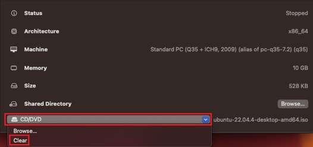

20. 确认 CD/DVD 选项中的 ISO 镜像关联已清除或清空。

    

21. 要运行 Ubuntu VM，请点击 **Play** 图标。

    

22. Ubuntu 操作系统成功启动后，输入凭据登录并访问 shell。

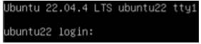

23. 运行以下命令更新 Ubuntu 操作系统并安装图形桌面环境，然后重新启动：

```shell
sudo apt update && sudo apt upgrade -y
sudo apt install ubuntu-desktop -y
reboot
```

24. 登录到您创建的 Ubuntu VM。

### 从 UTM VM 访问 RUBIK Pi 3

1. 将 RUBIK Pi 3 连接到主机。

UTM 软件可能会显示一个对话框，用于确认 Ubuntu 虚拟机操作系统是否应有权访问 RUBIK Pi 3。

    1. 如果看到如下对话框，请点击 **Confirm**：

    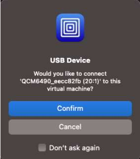

    2. 点击 **Confirm** 后，如果出现以下 USB 断开连接错误，点击 **OK** 忽略它：
    
    


2. 要验证 Ubuntu VM 是否可以访问 RUBIK Pi 3，请在 Linux 终端窗口中运行 `lsusb` 命令。

  RUBIK Pi 3 在输出中显示如下：

  

如果在 Ubuntu VM 中未检测到 RUBIK Pi 3 ，请执行以下操作：
     1. 在 UTM VM 窗口的工具栏中，点击 **USB Devices**。
     2. 选择 **QCMXXXX_xxxxxxxx**。

:::note

如果 RUBIK Pi 3 未出现在 USB 设备列表中，请在 UTM settings 中点击左侧面板中的 **Input**，并将 **Maximum Shared USB Devices** 字段中的值设置为 10。
:::

### 配置 Mac 的睡眠和唤醒设置以及 Ubuntu 的电源设置

要确保 Mac 主机和 Ubuntu VM 不因不活动而进入睡眠状态，请执行以下操作：

* 要配置 Mac 主机的睡眠和唤醒设置，请参见 [macOS User Guide](https://support.apple.com/en-in/guide/mac-help/mchle41a6ccd/mac)。

* 要配置 Ubuntu 的电源设置，请执行以下操作：

  1. 在 Ubuntu 的 **System Settings** 中，点击 **Power**。

  2. 关闭 **Automatic Suspend**。

:::note

 要同步、编译和刷写 Qualcomm Linux，参见 [Yocto 工程编译指南](11.yocto-project-user-guide.md)、[Linux kernel ](3.linux-kernel.md)等章节
:::

## Mac 开发环境搭建（x86\_64）
<a id="set86"></a>

使用 UTM 在 x86\_64 Mac 上搭建 Ubuntu VM。

UTM 是适用于 macOS 的开源 VM 主机，用于在 Mac 上运行其他操作系统，包括 Ubuntu。在 x86\_64 的 Mac 上使用 UTM 搭建 Ubuntu VM 涉及以下任务：


### 主机要求

在使用 UTM 设置 Ubuntu VM 之前，请确保您的 x86\_64 Mac 主机满足以下系统要求：

|         | 要求                            |
|-----------------------|------------------------------------------|
| 处理器架构 | x86_64<p>请在终端窗口中运行 `uname -a` 命令，以便验证 Mac 的架构是否为 x86_64。</p>|
| CPU 核数量           | 8 个或更多                              |
| RAM                   | 8 GB 或更大                           |
| 存储              | UTM VM 需要 300 GB 可用空间        |
| 操作系统     | macOS 13 或更高版本                      |

如果您的 x86\_64 Mac 主机满足系统要求，请下载以下软件：

| 软件                     | 说明 |
|------------------------------|-------------|
| UTM 虚拟化软件  | 从 [UTM 网站](https://mac.getutm.app/)下载 UTM 虚拟化软件。 |
| Ubuntu ISO                   | 支持所有 Ubuntu 22.04 64 位 PC (AMD64) 桌面 LTS 版本。建议用户从 [Ubuntu 网站](https://www.releases.ubuntu.com/22.04/) 下载最新的 Ubuntu 22.04 ISO（例如 ubuntu-22.04.5-desktop-amd64.iso）版本。|

### 在 x86\_64 Mac 上安装 UTM

1. 双击之前下载的 **UTM.dmg** 文件，然后将 **UTM** 图标拖到 **Applications** 图标。

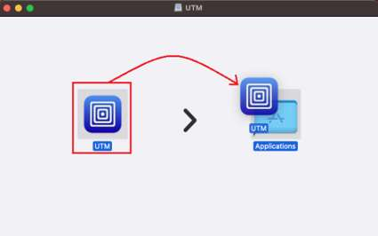

2. 安装 UTM 时，如果出现以下对话框，点击 **Open**：

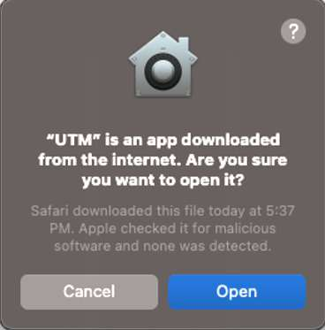

3. 打开 Launchpad，搜索 **UTM**，然后点击 **UTM。**

  出现 UTM 主窗口。


### 在 UTM 中创建 VM

1. 在 UTM 主窗口中，点击 **Create a New Virtual Machine**。

2. 在 **Start** 界面上，点击 **Virtualize**。

3. 在 **Operating System** 界面上，选择 **Linux OS**。

4. 在 **Linux** 界面上，浏览并选择您下载的 Ubuntu ISO 镜像，然后点击 **Continue**。

5. 在 **Hardware** 界面上，指定要分配给 Ubuntu VM 的内存和 CPU 核心，然后点击 **Continue**。推荐值如下：

   * 内存：大约 70% 的可用内存

   * CPU 核：至少 50% 的可用核

如果将 **CPU Cores** 字段留空或设置为 0，UTM 会将所有主机核心分配给 VM。将所有 CPU 核分配给 VM 可能会使主机运行缓慢或无响应。

:::note

要了解 Mac 主机的内存大小和 CPU 核数量，参见 [macOS User Guide](https://support.apple.com/en-in/guide/mac-help/syspr35536/mac) 中的说明。
:::

6. 在 **Storage** 界面上，指定 VM 的驱动器大小，然后点击 **Continue**。

:::note

建议为虚拟机分配至少 300 GB。
:::

7. 如果要在主机和虚拟机之间共享目录，请在 **Shared Directory** 界面上执行以下操作：

    1. 浏览并选择目录。

    2. 点击 **Continue**。

8. 在 **Summary** 界面上，执行以下操作：

    1. 查看正在创建的虚拟机的配置摘要。

    2. 为虚拟机取名。

    3. 点击 **Save** 新创建的虚拟机列在 UTM 主窗口中。

    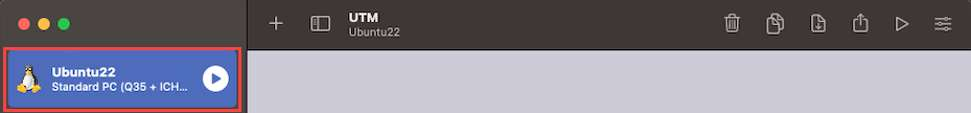

### 在 UTM 中安装 Ubuntu

1. 在 UTM 主窗口中，点击 **Play** 图标，通过虚拟化运行 Ubuntu ISO 镜像。

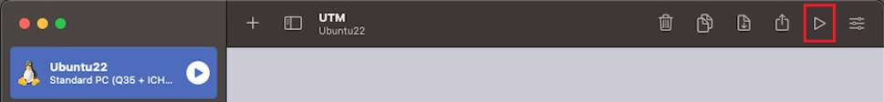

2. 使用箭头键选择 **Try or Install Ubuntu**，然后按 **Enter**。

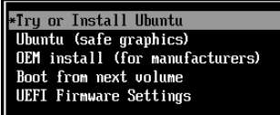

3. 在 **Welcome** 界面上，选择一种语言，然后点击 **Install Ubuntu**。

4. 在 **Keyboard Layout** 界面上，选择键盘布局，然后点击 **Continue**。

5. 在 **Updates and other software** 界面上，默认已选中 **Normal installation**。如果不需要安装所有 Ubuntu 操作系统功能，请选择 **Minimal installation** 选项按钮。

6. 在 **Installation type** 界面上，选择 **Erase disk and install Ubuntu** 选项按钮，然后点击 **Install Now**。

:::note

**Erase disk and install Ubuntu** 选项仅擦除分配给虚拟机的存储区域。它不会擦除主机上的任何其他数据或系统文件。
:::

7. 在 **Write the changes to disk?** 对话框中，点击 **Continue**。

8. 在 **Where are you?** 界面上，选择适当的时区。

9. 在 **Who are you?** 界面上，指定所需的详细信息，然后点击 **Continue** 开始安装。

10. 安装完成后，点击 **Restart Now**。

11. 要关闭并停止 VM，请点击 **Power** 图标。


12. 在 Confirmation 对话框中，点击 OK。虚拟机停止后，关闭窗口。

13. 在 UTM 主窗口中，在 **CD/DVD** 下拉列表中，选择 **Clear**。

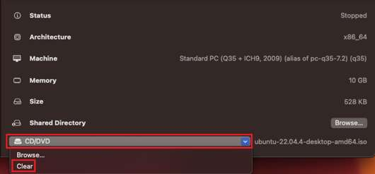

14. 确认 CD/DVD 选项中的 ISO 镜像关联已清除或清空。


15. 要运行 Ubuntu VM，请点击 **Play** 图标。


16. 登录到您创建的 Ubuntu VM。

### 从 UTM VM 访问 RUBIK Pi 3

1. 将 RUBIK Pi 3 连接到主机。

   UTM 软件可能会显示一个对话框，用于确认 Ubuntu 虚拟机操作系统是否应有权访问 RUBIK Pi 3。

   如果看到如下对话框，请点击 **Confirm**：

   

点击 **Confirm** 后，如果出现以下 USB 断开连接错误，点击 **OK** 忽略。


2. 要验证 Ubuntu VM 是否可以访问 RUBIK Pi 3，请在 Linux 终端窗口中运行 `lsusb` 命令。

RUBIK Pi 3 在输出中显示如下：

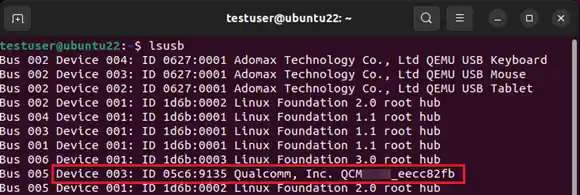

如果在 Ubuntu VM 中未检测到 RUBIK Pi 3，请执行以下操作：

    1. 在 UTM VM 窗口的工具栏中，点击 **USB Devices**。
    2. 选择 **QCMXXXX_xxxxxxxx**。

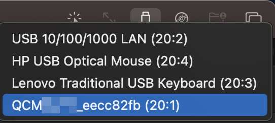

:::note

 如果 RUBIK Pi 3 未出现在 USB 设备列表中，请在 UTM settings 中点击左侧面板中的 **Input**，并将 **Maximum Shared USB Devices** 字段中的值设置为 10。
:::

### 配置 Mac 的睡眠和唤醒设置以及 Ubuntu 的电源设置

要确保 Mac 主机和 Ubuntu VM 不因不活动而进入睡眠状态，请执行以下操作：

* 要配置 Mac 主机的睡眠和唤醒设置，请参见 [macOS User Guide](https://support.apple.com/en-in/guide/mac-help/mchle41a6ccd/mac)。

* 要配置 Ubuntu 的电源设置，请执行以下操作：

  1. 在 Ubuntu 的 **System Settings** 中，点击 **Power**。

  2. 关闭 **Automatic Suspend**

  :::note
  
  要同步、编译和刷写 Qualcomm Linux，参见 [Yocto 工程编译指南](11.yocto-project-user-guide.md)、[Linux kernel ](3.linux-kernel.md)等章节。
  :::