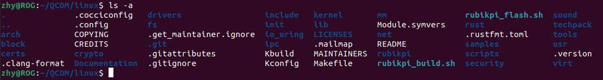
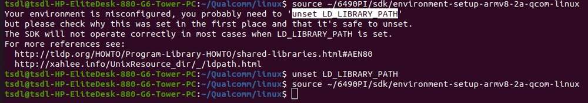
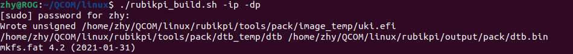
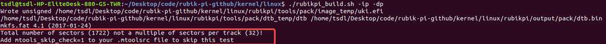
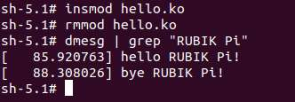

# Linux 内核
<a id="linuxkernel"></a>

推荐在 Ubuntu18 - Ubuntu22 系统下进行 Linux kernel 相关的开发。

## 代码下载

```shell
git clone https://github.com/rubikpi-ai/linux.git
git submodule init
git submodule update
```

## 目录分析

在执行完 `git clone` 命令后，RUBIK Pi 3 Linux 代码仓库的目录如下：



其中重要的文件夹或文件的含义如下：

| **名字**        | **描述**         | **名字**            | **描述**                          |
| ------------- | -------------- | ----------------- | ------------------------------- |
| arch          | 架构相关的目录        | security          | 安全架构相关的目录                       |
| block         | 块设备相关的目录       | sound             | 音频系统相关的目录                       |
| certs         | 认证和签名相关的目录     | tools             | 内核交互工具的目录                       |
| crypto        | 加密相关的目录        | usr               | 与 initramfs 相关的目录，用于生成initramfs |
| documentation | 文档相关的目录        | virt              | 提供虚拟机技术（KVM）的目录                 |
| drivers       | 驱动相关的目录        | rust              | Rust相关的目录                       |
| firmware      | 固件相关的目录        | rubikpi           | RUBIK Pi 3 相关的目录，存放编译工具等        |
| fs            | 文件系统相关的目录      | techpack          | 高通平台相关的驱动                       |
| include       | 头文件相关目录        | .config           | 内核编译最终使用的配置文件                   |
| init          | 内核初始化相关的目录     | Makefile          | 编译内核的主要文件                       |
| ipc           | 进程间通信相关的目录     | Kbuild            | 配置内核设定的脚本                       |
| kernel        | 内核最核心部分代码的目录   | Kconfig           | 图形化配置界面的配置文件                    |
| lib           | 内核核心库代码的目录     | MAINTAINERS       | 维护者名单                           |
| mm            | 内存管理相关代码的目录    | CREDITS           | Linux 贡献者                       |
| net           | 网络协议相关的代码目录    | COPYING           | 版权声明                            |
| samples       | 内核编程范例相关的目录    | rubikpi\_build.sh | RUBIK Pi 3 提供的编译、打包脚本           |
| scripts       | 内核编译、配置相关脚本的目录 | rubikpi\_flash.sh | RUBIK Pi 3 提供的烧录脚本              |

### 设备树

RUBIK Pi 3 的顶层设备树是 *rubikpi3.dts* ，可以在 *arch/arm64/boot/dts/qcom* 目录下找到，对于设备树的所有修改，推荐在此文件上进行。

除此之外，在开发过程中，同级目录的 *sc7280.dtsi* 也可能会高频查看。 *sc7280.dtsi&#x20;*&#x4E2D;拥有 GPIO、SPI、I2C、UART、CPU、GPU 等开发过程中较为常用的节点。

高通平台将显示、图形、摄像头、视频等相关的驱动和设备树从 linux kernel 源码中分离出来成独立的仓库，可根据 [Yocto 工程编译指南](11.yocto-project-user-guide.md) 章节下载 Yocto 工程源码，通过查看 *layers/meta-qcom-hwe* 目录下的 *.bb* 文件提供的信息访问具体的代码仓库，以查看摄像头的设备树为例：

查看 *layers/meta-qcom-hwe/recipes-multimedia/cameradlkm/cameradlkm\_1.0.bb&#x20;*&#x6587;件，有如下内容：

```shell
SRCPROJECT = "git://git.codelinaro.org/clo/le/platform/vendor/opensource/camera-kernel.git;protocol=https"
SRCBRANCH  = "camera-kernel.qclinux.1.0.r1-rel"
SRCREV     = "0f2b11fac7f13f76a9e9f8e25ae2de5c97b23169"
```

* 表示仓库的地址是 https://git.codelinaro.org/clo/le/platform/vendor/opensource/camera-kernel.git

* 分支为 `camera-kernel.qclinux.1.0.r1-rel`

* 具体的提交是 `0f2b11fac7f13f76a9e9f8e25ae2de5c97b23169`

为了编译的设备树烧录到板子后，板子可正常运行，RUBIK Pi 3 将这些独立 linux kernel 源码外的设备树子仓库，放到了 *arch/arm64/boot/dts/qcom* 目录下：

* 显示：*arch/arm64/boot/dts/qcom/display-devicetree*

* 摄像头：*arch/arm64/boot/dts/qcom/camera-devicetree*

* 图形：*arch/arm64/boot/dts/qcom/*&#x67;raphics-devicetree

* 视频：*arch/arm64/boot/dts/qcom/video-devicetree*

在使用 `./rubikpi_build.sh -d` 命令编译设备树时，会先编译内核设备树 *rubikpi3.dtb* 作为基本设备树，再将各子仓库的设备树覆盖到基本设备树中，最后覆盖 *arch/arm64/boot/dts/thundercomm/rubikpi3/rubikpi3-overlay.dtso* 设备树，推荐将对子仓库设备树的修改加入到 *rubikpi3-overlay.dtso&#x20;*&#x4E2D;。

## 代码编译
<a id="codecompile"></a>

1. 运行下面的命令设置交叉编译环境，具体请参考 [安装交叉编译工具](./14.set-up-development-environment.md#安装交叉编译工具)。

   ```shell
   source <your toolchains directory>/environment-setup-armv8-2a-qcom-linux
   ```

   :::note
   
   交叉编译环境只对当前终端有效。
   :::

   若出现如下错误，可按提示输入`unset LD_LIBRARY_PATH` 命令后，再次执行上面命令。

   

2. 进入内核目录，整编内核。

   ```shell
   ./rubikpi_build.sh -a
   ```

     :::note
     - 第一次编译的时间会比较长，时间因个人电脑配置而异，普遍在 20 分钟之内，当编译成功后，后面对代码修改只会编译修改的部分；
     - 使用 `./rubikpi_build.sh -c` 命令可以清理内核目录，清理后所有的编译生成物和部分配置内容都会被删除掉。
     :::

3. 进入内核目录，打包内核、设备树镜像。
<a id="Linuxkernelpack"></a>

   ```shell
   ./rubikpi_build.sh -dp -ip
   ```

   

   如果打包镜像时报错：

   

    执行下面命令编辑 *.mtoolsrc* 文件，并在其中添加 `mtools_skip_check=1`，然后再重新打包镜像。
    
    ```
    vim ~/.mtoolsrc
    ```
   :::warning
    在 2025 年 3 月份的更新中，若烧录了非 RUBIK Pi 3 官方发布的镜像，则需将对应镜像包中的 efi.bin 拷贝到 rubikpi/tools/pack 目录下后再进行打包。
   :::

   :::note
    使用 `./rubikpi_build.sh` 命令时，将完成步骤 2 和步骤 3 的操作。
   :::

4. 进入内核目录，烧录内核、设备树镜像。

 ```
  ./rubikpi_flash.sh -d -i -r
 ```

:::note
   烧录前，RUBIK Pi 3 需要进入 fastboot 模式，有下面两种进入方法：
   - 在 RUBIK Pi 3 终端输入：`reboot bootloader`，进入 fastboot 模式后，RUBIK Pi 3 上的蓝灯会亮起来。
   - 按住电源按钮开机，直到 RUBIK Pi 3 上的蓝灯亮起。
:::

5. 关于 *rubikpi\_build.sh* 和 *rubikpi\_flash.sh* 的用法可使用 `-h` 参数进行查看。

使用 `./rubikpi_buils.sh -h` 命令查看编译脚本使用方法。

示例输出

```shell
Usage:
  bash ./rubikpi_build.sh [options]

Options:
  -h, --help              display this help message
  -dp, --dtb_package      generate a burnable device tree image
  -ip, --image_package    generate a burnable kernel image
  -a, --build_all         Complete compilation of kernel
  -d, --build_dts         Complete compilation of device tree
  -gc, --generate_config  Generate. config file
  -c, --clean             Clean up workspace

```

使用 `./rubikpi_flash.sh -h `命令查看烧录脚本使用方法。

示例输出

```shell
Usage:
  bash ./rubikpi_flash.sh [options]

Options:
  -h, --help     display this help message
  -r, --reboot   exit fastboot mode
  -d, --dtb      flash device tree image
  -i, --image    flash kernel image
```

## 单独编译 ko 驱动模块

1. 创建 *Makefile&#x20;*&#x6587;件如下，修改 `KDIR` 为实际 kernel 源码在个人电脑上的目录。

   ```makefile
   obj-m += hello.o
   KDIR:=/home/rubikpi/kernel-6.6
   PWD?=$(shell pwd)
   all:
           make -C $(KDIR) M=$(PWD) modules
           echo $(PWD)
   clean:
           rm -f *.ko *.o *.mod *.mod.o *.mod.c *.symvers *.order

   ```

2. 创建 *hello.c&#x20;*&#x6587;件如下：

   ```c
   #include <linux/module.h>
   #include <linux/init.h>

   static int hello_init(void)
   {
       printk("hello RUBIK Pi!\n");
       return 0;
   }

   static void hello_exit(void)
   {
       printk("bye RUBIK Pi!\n");
   }

   module_init(hello_init);
   module_exit(hello_exit);

   MODULE_LICENSE("GPL");
   MODULE_VERSION("V1.0");
   MODULE_AUTHOR("RUBIK Pi");
   ```

3. 执行命令编译 ko 模块：

   ```bash
   export ARCH=arm64
   export CROSS_COMPILE=aarch64-qcom-linux-
   make
   ```

4. 将 hello.ko 传到 RUBIK Pi 3 中，可以使用 ADB、SCP 等方式。

5. 在 RUBIK Pi 3 中执行如下命令，验证编译生成物有效：

   ```shell
   insmod hello.ko 
   rmmod hello.ko 
   dmesg | grep "RUBIK Pi"

   ```

    

## 内核配置

使用 `menuconfig` 对 Linux 内核进行配置，执行如下命令：

```bash
cd linux
make ARCH=arm64 menuconfig
```

配置完成并执行如下命令将配置保存。

```shell
make ARCH=arm64 savedefconfig
cp defconfig ./arch/arm64/configs/rubik_pi3_defconfig
```
